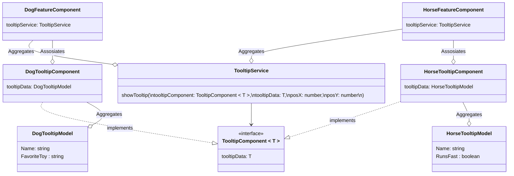

```mermaid
classDiagram
class DogFeatureComponent {
 tooltipService: TooltipService
}
class DogTooltipModel {
  Name: string
  FavoriteToy : string
}
class DogTooltipComponent {
  tooltipData: DogTooltipModel
}
class HorseFeatureComponent {
 tooltipService: TooltipService
}

class HorseTooltipModel {
  Name: string
  RunsFast : boolean
} 
class `TooltipComponent &lt; T &gt;` {
  tooltipData: T
}
<<interface>> `TooltipComponent &lt; T &gt;`
class HorseTooltipComponent {
  tooltipData: HorseTooltipModel
}
class `TooltipService` {
  showTooltip(\ntooltipComponent: TooltipComponent &lt; T &gt;,\ntooltipData: T,\nposX: number,\nposY: number\n)
}

DogTooltipComponent ..|>  `TooltipComponent &lt; T &gt;`: implements
DogTooltipComponent --o DogTooltipModel : Aggregates
DogFeatureComponent --o `TooltipService` : Aggregates
DogFeatureComponent --o DogTooltipComponent : Assosiates


HorseTooltipComponent ..|>  `TooltipComponent &lt; T &gt;`: implements
HorseTooltipComponent --o  HorseTooltipModel : Aggregates

`TooltipService` --> `TooltipComponent &lt; T &gt;`
HorseFeatureComponent --o `TooltipService` : Aggregates
HorseFeatureComponent --o HorseTooltipComponent : Assosiates
```
